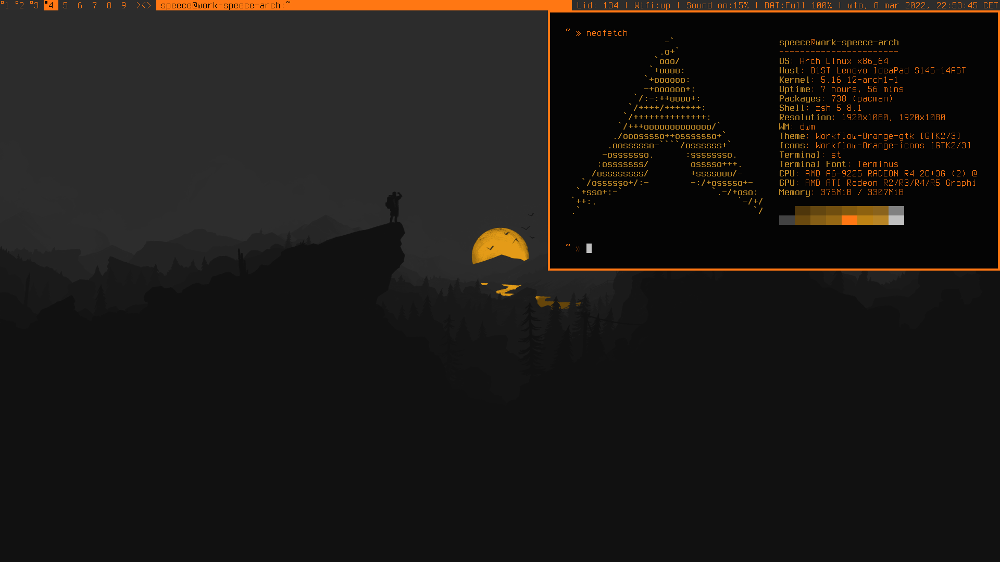
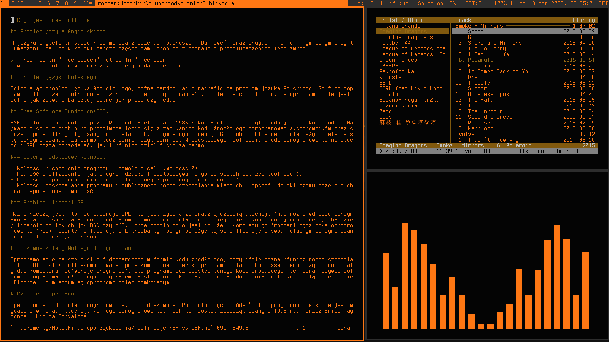
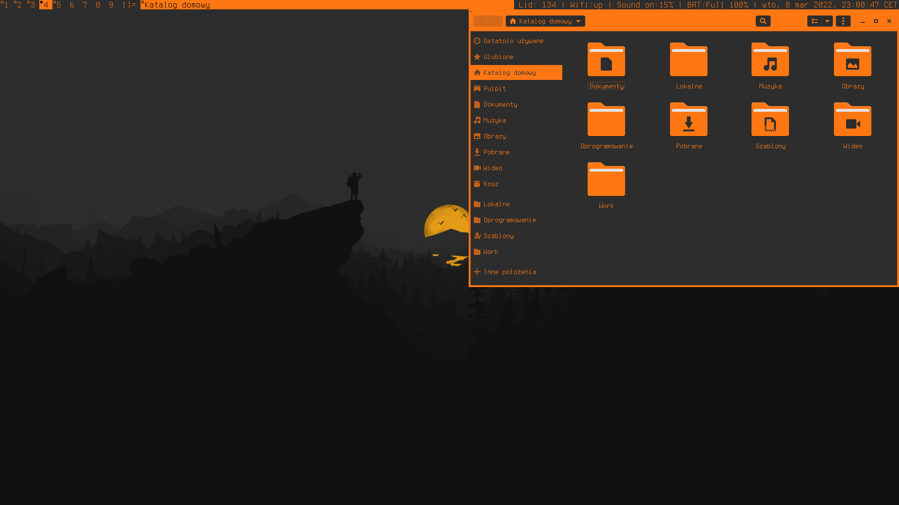
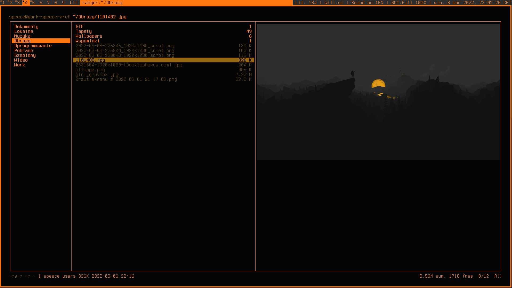

# .pyRINDE

Python Rinde is not desktop Environment - Workflow
Zbiór skryptów i konfiguracji narzędzi suckless, których używam na codzie

# Pakiety:

- terminus-font
- feh 
- python
- base-devel
- go
- cmus

# Instalacja oh-my-zsh i autosuggestion

## Oh my zsh

`sh -c "$(wget -O- https://raw.githubusercontent.com/ohmyzsh/ohmyzsh/master/tools/install.sh)"`

## Zsh autosuggestions

`git clone https://github.com/zsh-users/zsh-autosuggestions ${ZSH_CUSTOM:-~/.oh-my-zsh/custom}/plugins/zsh-autosuggestions\`

### W przypadku nowej konfiguracji trzeba dodać do pliku .zshrc następującą linijkę:

`plugins=( zsh-autosuggestions)`
# Tworzenie modułów
Wszystkie moduły powinny być układane w następujące drzewo plików:

- Nazwa Modułu
	- README.md
	- Pliki_skryptu
	- install
		- install.sh
		- wymagane_pliki_konfiguracyjne  

## CMUS
`:colorscheme dracula-speece`
